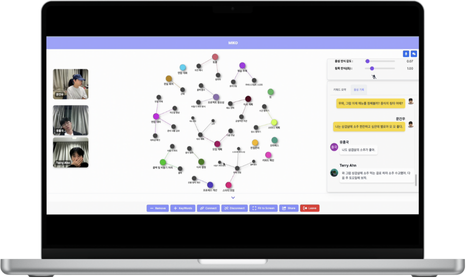

# MIKO

<p align="center">
  
</p>

<p align="center">
  Meeting In, Keywords Out
</p>

## Tech Stack

<p align="center">
  
  
  
  
  
</p>

## Getting Started

To start the development server, use one of the following commands:
> 
> ```bash
> npm run dev
> # or
> yarn dev
> # or
> pnpm dev
> # or
> bun dev
> ```
Open http://localhost:3000 with your browser to see the result.

## 프로젝트 설명 | Project Description

**MIKO** (Meeting In, Keywords Out)는 미팅 중 주요 키워드를 자동으로 추출하여 사용자들이 문맥을 쉽게 파악할 수 있도록 마인드맵 형식으로 키워드를 관리해주는 프로그램입니다.
**MIKO** (Meeting In, Keywords Out) is a program that automatically extracts key words during meetings and organizes them into a mind map format, making it easier for users to grasp the context.

<p align="center">
  
</p>

### 주요 기능 | Key Features
- **실시간 STT 변환** : 대화 내용을 실시간으로 음성 기록 탭에 렌더링합니다.
**Real-time STT Conversion** : Renders the conversation content in real-time in the voice recording tab.
- **자동 요약 및 키워드맵 제공** : 서버에서 받아온 키워드들을 Vis.js의 네트워크 그래프로 시각화합니다. 각 노드는 다른 노드와 연결하거나 연결을 끊어 그룹으로 관리할 수 있습니다.
**Automatic Summary and Keyword Map** : Visualizes keywords received from the server as a network graph in Vis.js. Each node can be linked or unlinked with other nodes for group management.
- **녹취록과 타임스탬프 제공** : 회의 종료 후 음성 파일을 제공하며, 타임스탬프를 통해 음성 파일 내에서 특정 내용을 쉽게 찾을 수 있습니다.
**Transcripts and Timestamps** : Provides an audio file after the meeting, with timestamps to easily locate specific content within the audio file.
- **자동 회의록 제공** : 회의 종료 후 회의록 초안을 자동으로 생성합니다. 사용자는 추후 키워드맵과 녹취록을 통해 회의록을 수정할 수 있습니다.
**Automatic Meeting Minutes** : Automatically generates a draft of the meeting minutes after the meeting. Users can later edit the minutes using the keyword map and transcript.

### 페이지 설명 | Page Descriptions
- **루트 페이지** : Next-Auth 구글 로그인 구현
Root Page: Next-Auth Google login implementation
<p align="center">
  
</p>

- **waiting 페이지** : 카메라 및 오디오 세팅 페이지
Waiting Page: Camera and audio settings page
<p align="center">
  
</p>

- **meetingRoom 페이지** : 메인 회의 화면
Meeting Room Page: Main meeting screen
<p align="center">
  
</p>

- **result 페이지** : 결과화면. 회의록과 녹취록 제공
Result Page: Results screen. Provides meeting minutes and transcripts
<p align="center">
  
</p>

- **board 페이지** : 회의록 게시판 
 board Page: meeting minutes bulletin board


<p align="center">
  
</p>

## 배포 주소 | Deployment URL
[https://www.mi-ko.site/](https://www.mi-ko.site/)